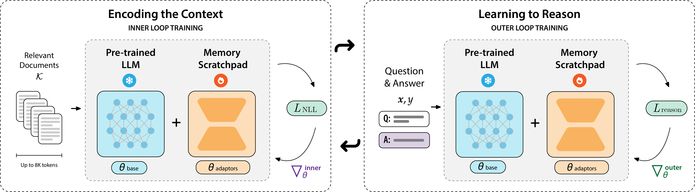

# PERK: Long-Context Reasoning as Test-Time Learning

[](https://opensource.org/licenses/MIT)

This is the official implementation of the paper: **[PERK: Long-Context Reasoning as Test-Time Learning](https://arxiv.org/abs/2507.06415)**.

**Project Page**: [https://perk-long-context.web.app](https://perk-long-context.web.app)

*More details about the implementation & experiments will be added and refined in the coming months.*



## Table of Contents

- [PERK: Long-Context Reasoning as Test-Time Learning](#perk-long-context-reasoning-as-test-time-learning)
  - [Table of Contents](#table-of-contents)
  - [Overview](#overview)
    - [Abstract](#abstract)
  - [Installation](#installation)
  - [Quick Start](#quick-start)
    - [Training](#training)
    - [Configuration](#configuration)
  - [Evaluation](#evaluation)
  - [Model Architecture](#model-architecture)
  - [Dataset](#dataset)
  - [Meta-Learning Library](#meta-learning-library)
  - [Citation](#citation)
  - [License](#license)

## Overview

PERK is a novel approach for long-context reasoning that formulates the task as a test-time learning problem. This repository contains the implementation of PERK, including training and evaluation code for long-context reasoning tasks.

### Abstract

Long-context reasoning requires accurately identifying relevant information in extensive, noisy input contexts. Previous research shows that using test-time learning to encode context directly into model parameters can effectively enable reasoning over noisy information. However, meta-learning methods for enabling test-time learning are prohibitively memory-intensive, preventing their application to long context settings.

In this work, we propose PERK (**P**arameter **E**fficient **R**easoning over **K**nowledge), a scalable approach for learning to encode long input contexts using gradient updates to a lightweight model adapter at test time. Specifically, PERK employs two nested optimization loops in a meta-training phase. The inner loop rapidly encodes contexts into a low-rank adapter (LoRA) that serves as a parameter-efficient memory module for the base model. Concurrently, the outer loop learns to use the updated adapter to accurately recall and reason over relevant information from the encoded long context.

Our evaluations on several long-context reasoning tasks show that PERK significantly outperforms the standard prompt-based long-context baseline, achieving average absolute performance gains of up to 90% for smaller models (GPT-2) and up to 27% for our largest evaluated model, Qwen-2.5-0.5B. In general, PERK is more robust to reasoning complexity, length extrapolation, and the locations of relevant information in contexts. Finally, we show that while PERK is memory-intensive during training, it scales more efficiently at inference time than prompt-based long-context inference.

## Installation

1. Clone this repository:

```bash
git clone https://github.com/eric11eca/perk.git
cd perk
```

2. Install the required dependencies:

```bash
pip install -r requirements.txt
```

3. Modify the Qwen modeling code in HF transformers to support differentiable operations.

Due to the Monkey Patched Qwen model, the code is not compatible with the original HF transformers. You need to modify the Qwen modeling code in HF transformers to support differentiable operations. Basically, find the following line of code in the Qwen model:

```python
for decoder_layer in self.layers[: self.config.num_hidden_layers]:
```

And change it to:

```python
for i in range(self.config.num_hidden_layers):
    decoder_layer = self.layers[i]
```

## Quick Start

### Training

To train PERK on your dataset, prepare your data in the appropriate format and update the configuration file. Then run:

```bash
python run_maml.py experiment=meta_train
```

### Configuration

The main configuration files are located in the `configs/` directory:

- `configs/experiment/meta_train.yaml`: Configuration for meta-training
- `configs/experiment/meta_test.yaml`: Configuration for meta-testing

## Evaluation

To evaluate a trained PERK model:

```bash
python run_maml.py experiment=meta_test
```

## Model Architecture

PERK consists of:

1. A base language model (LLM) for text understanding
2. A lightweight weighting model for test-time adaptation
3. A meta-learning framework for efficient adaptation to new tasks

The model architecture is implemented in `perk/model.py` and uses PEFT (Parameter-Efficient Fine-Tuning) for efficient training.

## Dataset

Sample datasets are provided in the `data_samples/` directory. The code supports various long-context reasoning tasks, including:

- Babi Long-context QA
- Student Records DB tasks
- LongGorilla code API retrieval

## Meta-Learning Library

We use **Higher** as the backend engine and differentiable optimizers for meta-learning and higher-order differentiation.
The code is located in the `higher` folder. The `higher/optim.py` file is the main file for the engine and differentiable optimizers.

## Citation

If you find this work useful for your research, please cite:

```bibtex
@article{chen2025perklongcontextreasoningparameterefficient,
  title={PERK: Long-Context Reasoning as Parameter-Efficient Test-Time Learning},
  author={Zeming Chen and Angelika Romanou and Gail Weiss and Antoine Bosselut},
  year={2025},
  eprint={2507.06415},
  archivePrefix={arXiv},
  primaryClass={cs.CL},
  url={https://arxiv.org/abs/2507.06415}
}
```

## License

This project is licensed under the MIT License - see the [LICENSE](LICENSE) file for details.
